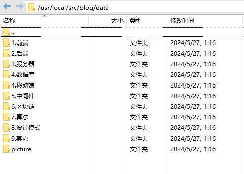

# 博客

# 介绍

一个简单的 Markdown 文档编辑服务器


# 为什么要用blog-cloud

- 我已经有一个[blog](https://github.com/luode0320/blog)博客网站, 但是这个网站只能查看不能编辑。
- 所以我需要一个可以在线编辑md文件的服务, 编辑之后可以通过我自带的博客网站查看。


# 软件架构

- go1.21
- sqlite / postgres
- vue3

# 编译步骤

- 安装 go 环境
- 安装 nodejs 环境
- 进入目录，添加权限并执行 **build.bat** 或 **build.sh**
- 编译后的可执行文件在 **./md** 目录下
- 执行**./md** 目录下的可执行文件

# 命令行参数

- `-p`：监听端口号。默认值：**9900**
- `-log`：日志目录，存放近 30 天的日志。默认值：**./logs**
- `-data`：数据目录，存放数据库文件和图片。默认值：**./data**
- `-reg`：是否允许注册（即使禁止注册，在没有任何用户的情况时仍可注册）。默认值：**true**
- `-pg_host`：postgres 主机地址
- `-pg_port`：postgres 端口
- `-pg_user`：postgres 用户
- `-pg_password`：postgres 密码
- `-pg_db`：postgres 数据库名
- `-re_db`：清空数据库数据, 配合注册admin用户, 可以将data目录下md文件加载到数据库中

## 数据库选择

当 postgres 相关的 5 个命令行参数全部填写时，将使用 postgres 数据库，否则使用默认的 sqlite 数据库

# docker
## 拉取

```
docker pull luode0320/blog-cloud:latest
```

## 配置

```sh
mkdir -p /usr/local/src/blog-cloud
cd /usr/local/src/blog-cloud
```

输入:

sqlite: 内置数据库
```sh
docker run -d \
--name blog-cloud \
--restart always \
-p 4001:9900 \
-v /usr/local/src/blog/data:/md/data \
luode0320/blog-cloud:latest
```
postgres: 数据库
```shell
docker run -d \
--name blog-cloud \
--restart always \
-p 4001:9900 \
-v /usr/local/src/blog/data:/md/data \
-e pg_host="0.0.0.0" \
-e pg_port=5432 \
-e pg_user=postgres \
-e pg_password=123456 \
-e pg_db=blog \
luode0320/blog-cloud:latest
```

```sh
http://127.0.0.1:4001/
```

# 隐含的功能

- 收缩边栏：点击左上角博客标题
- md文件: 保存的md文件生成在挂载的 data 目录下, 引用的图片在 picture 目录
